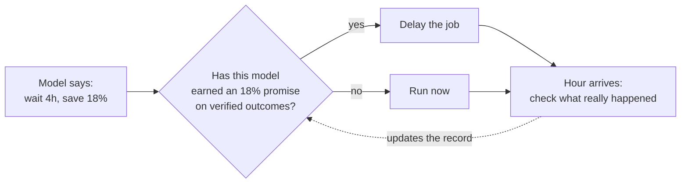

# Nishit S K

**Backend · Cloud · Data** — and frontend that has to rank. Final-year CSE, Sahyadri College of Engineering, Mangaluru.

---

## The thing I'd want you to read

**[CADSS — a carbon-aware cloud scheduler](https://github.com/NishitSK/CARBONMAJOR)**, run live on 13 AWS regions.

It puts each workload on the cleanest electricity grid that still meets its latency SLA and data-residency law. Three scheduling policies ran side by side, hourly, dispatching real jobs through AWS Systems Manager.

It cuts carbon intensity **94.7%** against a carbon-blind baseline. That's the least interesting thing about it:

- A held-out statistical decomposition shows **97% of the saving comes from picking the right region once**, not from reacting hour to hour.
- Across **25,000+ verified forecasts**, the model with the *lower* error made the *worse* decisions — it delivered net-negative savings on the delays it recommended.
- So every forecast now has to earn the right to delay work:

That loop disabled one of my two models, and later withdrew a horizon from the other. A guard worth having has to be able to say no to you.

Paper accepted for presentation at an IEEE conference, October 2026.

---

## Shipped during my internship

**[squish.urudha.com](https://squish.urudha.com)** — free in-browser image tools: WebP conversion, compression, background removal, PDFs, watermarks, EXIF. Built at **Urudha** (May–Jul 2026) in Next.js and React, and I owned how it gets found.

<b>What "owned the search side" means</b>

 

- **Programmatic landing pages** for the queries people actually type — `jpg-to-webp`, `heic-to-webp`, `compress-image`, `batch-image-converter` — each with its own title, description and single H1.
- **Structured data**: FAQPage schema on tool pages, plus WebSite, Organization and ItemList JSON-LD.
- **Crawl hygiene**: server-rendered routes, canonicals, Open Graph and Twitter cards, robots.txt and a sitemap.
- **Core Web Vitals**: image optimisation, lazy loading, bundle-size cuts.

View source on any tool page — it's all there.

---

## Other things I've built

| | | |
|---|---|---|
| **[Medallion Data Lake](https://github.com/NishitSK/airflow-spark-medallion-pipeline)** | Raw → Bronze → Silver → Gold ETL, validated and retried at each layer | Spark · Airflow · S3 · EC2 · Docker |
| **[EventSphere](https://github.com/NishitSK/EventSphere)** | Campus event platform, auto-deployed on every push to main | MERN · Docker · Nginx · GitHub Actions · EC2 |
| **[ISL Detection](https://github.com/NishitSK/HANDSIGNDETECTION)** | Real-time Indian Sign Language translation with speech output | Python · computer vision |
| **[LearnPath-AI](https://github.com/NishitSK/LearnPath-AI)** | Personalised skill-gap analyser | JavaScript · LLM APIs |
| **[Pantry Guardian](https://github.com/NishitSK/PANTRY-GUARDIAN)** | OCR receipt scanning and expiry prediction | Next.js · FastAPI · MongoDB · Gemini |

---

## Tools I reach for

plus statsmodels · pandas · Spark · Airflow · boto3 · technical SEO · structured data

---

<picture>
  <source media="(prefers-color-scheme: dark)" srcset="https://raw.githubusercontent.com/NishitSK/NishitSK/output/github-snake-dark.svg" />
  <source media="(prefers-color-scheme: light)" srcset="https://raw.githubusercontent.com/NishitSK/NishitSK/output/github-snake.svg" />
  
</picture>

